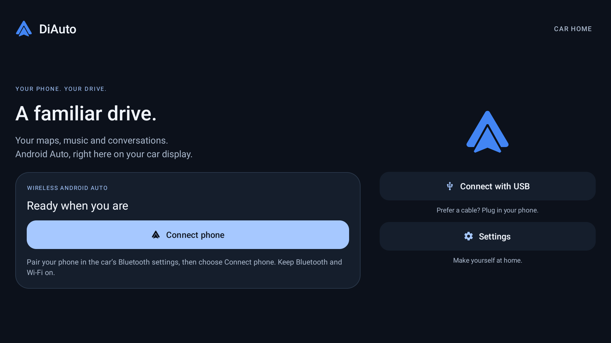

# DiAuto

**Android Auto on your BYD display. Wireless or USB.**

[Download & installation](https://shihabal3amri.github.io/DiAuto/) ·
[Latest release](https://github.com/shihabal3amri/DiAuto/releases/latest) ·
[Telegram updates](https://t.me/byd_localized)

[English](https://shihabal3amri.github.io/DiAuto/) · [العربية](https://shihabal3amri.github.io/DiAuto/ar/) · [Русский](https://shihabal3amri.github.io/DiAuto/ru/) · [Español](https://shihabal3amri.github.io/DiAuto/es/) · [简体中文](https://shihabal3amri.github.io/DiAuto/zh-Hans/)

Install DiAuto **on the car**, then connect a compatible Android phone using its built-in
Android Auto support. **No additional phone companion app, dongle, external hardware,
root or firmware modification is required.** An Android phone is still required;
this is not Apple CarPlay.



## Features

- Native wireless Android Auto, with USB data-cable support.
- Car-friendly home screen, simplified settings and redesigned option dialogs.
- Music-through-car-Bluetooth mode to avoid competing media audio focus.
- Automatic preference for the car's existing non-DFS 5 GHz Wi-Fi channel when supported,
  with normal band selection as a fallback.
- Bounded SurfaceView frame pacing, full-screen 1080p and corrected touch alignment.

## Compatibility and setup

Tested on **BYD DiLink 5.1 with Android 13**, using wireless and physical USB connections.
Other models and firmware versions are not yet verified. A compatible Android phone
with functioning Android Auto is required. The download site's languages do not imply
that every in-app label has been translated.

See the [installation guide](docs/INSTALL.md), including permissions, Static BSSID and
upgrading from private previews. APK installation must be allowed by your head unit.
Set up while parked.

The tested panel exposes approximately 58 Hz. Recent wireless map-drag samples reached
47–58 displayed FPS after Wi-Fi channel alignment, with remaining variation and occasional
stalls. **Constant 60 FPS is not promised.** See [validation notes](docs/REVIEW.md).

## Build

Requires JDK 17, Android SDK 36, NDK `29.0.14206865`, and CMake `3.22.1`.
Set `ANDROID_HOME` or an untracked `local.properties` with `sdk.dir=...`.

```sh
./gradlew :app:testGithubDebugUnitTest :app:assembleGithubDebug :app:assembleGithubRelease
```

APKs are under `app/build/outputs/apk/github/`. Release builds use R8/resource shrinking.
They are unsigned unless an untracked `key.properties` provides:

```properties
storeFile=/absolute/path/to/your-release-keystore.p12
storePassword=YOUR_PRIVATE_PASSWORD
keyAlias=YOUR_KEY_ALIAS
keyPassword=YOUR_PRIVATE_PASSWORD
```

Never commit signing keys or passwords. Your self-built APK will not upgrade a public
release unless signed with the same key. The public release signing key is held privately
by the maintainer. Application ID: `com.andrerinas.headunitrevived`.
Only the `github` flavor is covered by this fork's CI.

## Website

Five static language editions live under `site/`. Edit `site/content.json`, then run
`python3 scripts/build_site.py`. GitHub Actions deploys only `site/` to GitHub Pages.

## Credits and license

DiAuto is an independent fork of [Open Headunit](https://github.com/andreknieriem/open-headunit),
based on work by its contributors and [Michael Reid](https://github.com/mikereidis/headunit).
The local DiLink fork began from upstream commit `562c8dc`; the first public snapshot
includes the DiAuto modifications developed from that fork.

See [LICENSE](LICENSE) (AGPL-3.0), original copyright notices, in-app credits and
[third-party notices](docs/THIRD_PARTY.md). This repository contains the source for the
published app. Android Auto is a Google trademark. This project is not affiliated with
or endorsed by Google or BYD.
